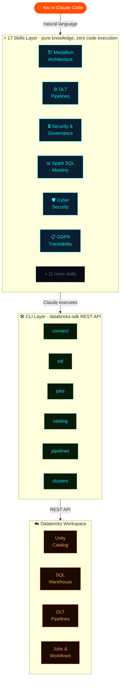
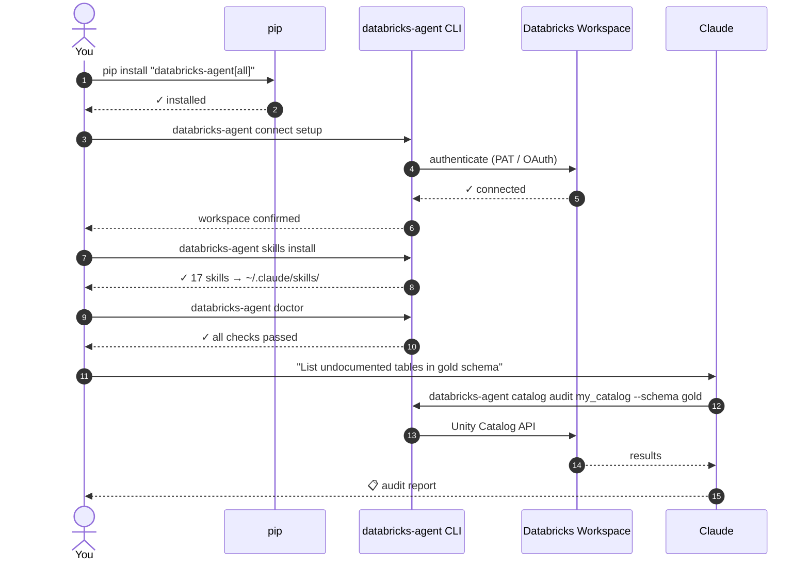
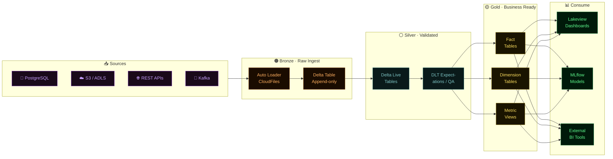
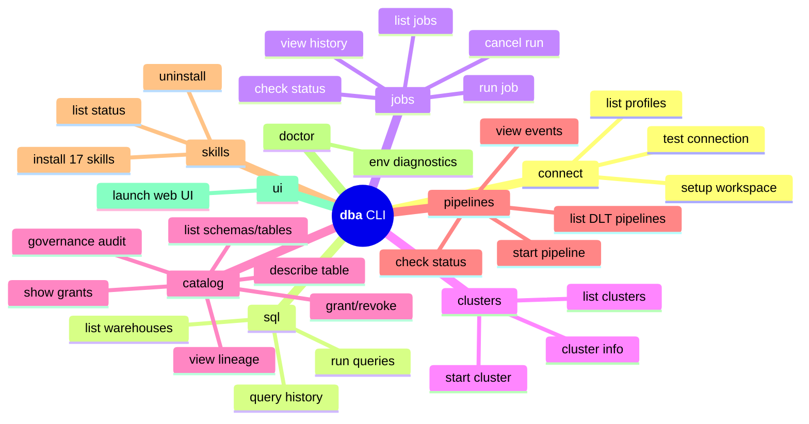
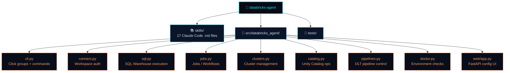

<div align="center">

```
╔═══════════════════════════════════════════════════════════════════════╗
║                                                                       ║
║    ██████╗  █████╗ ████████╗ █████╗ ██████╗ ██████╗  ██╗ ██████╗    ║
║    ██╔══██╗██╔══██╗╚══██╔══╝██╔══██╗██╔══██╗██╔══██╗██╔╝██╔════╝    ║
║    ██║  ██║███████║   ██║   ███████║██████╔╝██████╔╝██║ ██║         ║
║    ██║  ██║██╔══██║   ██║   ██╔══██║██╔══██╗██╔══██╗██║ ██║         ║
║    ██████╔╝██║  ██║   ██║   ██║  ██║██████╔╝██║  ██║██║ ╚██████╗    ║
║    ╚═════╝ ╚═╝  ╚═╝   ╚═╝   ╚═╝  ╚═╝╚═════╝ ╚═╝  ╚═╝╚═╝  ╚═════╝   ║
║                                                                       ║
║              A  G  E  N  T   //  T R O N · A R E S                  ║
║         AI-powered Databricks analytics engineering                   ║
╚═══════════════════════════════════════════════════════════════════════╝
```

[](https://python.org)
[](https://github.com/databricks/databricks-sdk-py)
[](skills/)
[](LICENSE)
[](https://www.linkedin.com/in/santoshkanthety/)

> **Give Claude Code enterprise-grade Databricks superpowers**
> AI-native CLI + 17 Claude Code skills · Unity Catalog · Delta Live Tables · Zero-trust security

</div>

---

## ⚡ What is this?

**databricks-agent** turns Claude into a Databricks expert. Once installed, Claude understands your workspace, Delta Lake patterns, Unity Catalog governance, DLT pipelines, and analytics engineering workflows — activated automatically by context, no copy-pasting docs required.

Built by **[Santosh Kanthety](https://www.linkedin.com/in/santoshkanthety/)** · 20+ years of Technology & Data transformation delivery and strategy.

---

## 🔭 How It Works



---

## 🔧 Prerequisites

| Requirement | Version | Notes |
|---|---|---|
| **Python** | 3.10 – 3.14 | `python --version` |
| **pip** | Latest | `pip install --upgrade pip` |
| **Claude Code** | Latest | [Install guide](https://claude.ai/code) — required for skills |
| **Databricks Workspace** | Any cloud | Azure / AWS / GCP — Unity Catalog recommended |
| **Databricks SDK** | Latest | Auto-installed with `pip install databricks-agent` |
| **Authentication** | PAT or OAuth | Personal Access Token **or** OAuth M2M service principal |
| **SQL Warehouse** | Active | Required for `databricks-agent sql` commands |
| **Unity Catalog** | Enabled | Required for `catalog` commands — metastore must be attached |
| **Delta Live Tables** | Optional | Required for `pipelines` commands |
| **MLflow** | Optional | `pip install "databricks-agent[ml]"` — ML workflow skills |

<details>
<summary><code>► Getting a Personal Access Token (PAT)</code></summary>

1. Open your Databricks workspace
2. Click your username (top-right) → **Settings** → **Developer**
3. Click **Access Tokens** → **Generate new token**
4. Set a description and expiry, then copy the token
5. Run `databricks-agent connect setup` and paste it when prompted

</details>

<details>
<summary><code>► Supported Cloud Host Formats</code></summary>

| Cloud | Host format |
|---|---|
| **Azure** | `https://adb-<id>.<region>.azuredatabricks.net` |
| **AWS** | `https://<id>.cloud.databricks.com` |
| **GCP** | `https://<id>.<region>.gcp.databricks.com` |

</details>

---

## 🚀 Quickstart



**Then just ask Claude:**

```
"Run an incremental load from bronze.orders to silver.orders"
"Check the status of my nightly ETL job and show failures"
"Explain the column lineage of catalog.gold.revenue_summary"
"Set up row filters so each region only sees their own data"
"Detect any credential leaks in my notebooks"
```

---

## 🏗️ Data Pipeline Architecture



---

## ⬡ 17 Claude Code Skills

Skills are markdown knowledge files that activate automatically when Claude detects matching keywords. Install once, use forever.

```bash
databricks-agent skills install   # → ~/.claude/skills/
```

### 🏗️ Architecture & Modeling
| Skill | Triggers on |
|---|---|
| `medallion-architecture` | bronze · silver · gold · Delta Lake · V-Order · Liquid Clustering |
| `delta-modeling` | star schema · SCD · fact table · dimension · surrogate key · grain |
| `spark-sql-mastery` | window function · aggregation · CTE · explain plan · OVER PARTITION |

### ⚙️ Ingestion & Pipelines
| Skill | Triggers on |
|---|---|
| `dlt-pipelines` | Delta Live Tables · Auto Loader · CDC · APPLY CHANGES · Workflows |
| `source-integration` | PostgreSQL · JDBC · Kafka · REST API · Auto Loader · S3 · ADLS |
| `data-transformation` | union · merge · dedup · schema drift · surrogate key · upsert |

### 📊 Analytics & Metrics
| Skill | Triggers on |
|---|---|
| `metric-glossary` | dbt metrics · semantic layer · metric definition · KPI · undocumented |
| `dashboard-authoring` | Lakeview · DBSQL · chart · filter · parameter · drilldown |
| `time-series-data` | time series · gaps · LOCF · binning · IoT · streaming window |

### 🔒 Security & Governance
| Skill | Triggers on |
|---|---|
| `security-governance` | row filter · column mask · GRANT · ACL · audit log · PII |
| `data-governance-traceability` | GDPR · CCPA · erasure · DSAR · lineage · retention · consent |
| `cyber-security` | threat detection · secrets · zero trust · SOC2 · credential leak |
| `data-catalog-lineage` | Unity Catalog · lineage · tagging · endorsement · impact analysis |

### ⚡ Performance & Operations
| Skill | Triggers on |
|---|---|
| `performance-scale` | slow query · cluster sizing · Photon · AQE · shuffle · spill |
| `testing-validation` | DLT expectations · reconciliation · dbt test · assertion · UAT |
| `project-management` | delivery · sprint · RAID log · go-live · hypercare · SLA |
| `databricks-connect` | connect · auth · PAT · OAuth · workspace · no connection |

---

## 🛠️ CLI Command Suite



---

## 💡 Live Examples

```bash
# ── SQL & Warehouses ─────────────────────────────────────────────
dba sql query --sql "SELECT * FROM catalog.gold.revenue LIMIT 10" \
              --warehouse my-warehouse --output table

# ── Jobs & Workflows ─────────────────────────────────────────────
dba jobs run --name nightly-etl
dba jobs status --run-id 12345
dba jobs history --name nightly-etl --limit 10

# ── Unity Catalog ─────────────────────────────────────────────────
dba catalog list my_catalog --schema gold
dba catalog describe catalog.gold.revenue_summary
dba catalog lineage catalog.gold.revenue_summary
dba catalog audit my_catalog --schema gold          # governance gaps

# ── DLT Pipelines ────────────────────────────────────────────────
dba pipelines start --name orders-pipeline
dba pipelines events --name orders-pipeline --limit 20

# ── Clusters ─────────────────────────────────────────────────────
dba clusters list
dba clusters start --name prod-cluster
```

---

## 📦 Installation Options

```bash
# Core CLI
pip install databricks-agent

# + Web configuration UI  (FastAPI)
pip install "databricks-agent[ui]"

# + MLflow / ML workflow support
pip install "databricks-agent[ml]"

# Everything
pip install "databricks-agent[all]"
```

**Auth methods supported (via Databricks SDK):**
`PAT token` · `~/.databrickscfg profiles` · `DATABRICKS_HOST + DATABRICKS_TOKEN env vars` · `OAuth M2M` · `Azure Managed Identity` · `Entra ID`

---

## 📁 Project Structure



---

## 🤝 Contributing

PRs welcome — see [CONTRIBUTING.md](CONTRIBUTING.md).

```
Priority areas:
  ⚡ New skills  (ML/MLflow, cost optimization, streaming patterns)
  🛠  CLI commands  (workspace files, secrets, volumes)
  🧪 Integration tests
  🎨 Web UI improvements

Setup:
  git clone https://github.com/santoshkanthety/databricks-agent
  pip install -e ".[all]"
  pytest
```

---

<div align="center">

```
╔═══════════════════════════════════════════════════════════════╗
║                                                               ║
║   ⚡  DATABRICKS · AGENT  //  TRON ARES  //  v0.1.0          ║
║                                                               ║
║   Built by  SANTOSH KANTHETY                                  ║
║   20+ years of Technology & Data transformation               ║
║   delivery and strategy                                       ║
║                                                               ║
║   github.com/santoshkanthety/databricks-agent                 ║
║   linkedin.com/in/santoshkanthety                             ║
║                                                               ║
║   If this saves you time — give it a ★                        ║
║                                                               ║
╚═══════════════════════════════════════════════════════════════╝
```

MIT License · Inspired by [powerbi-agent](https://github.com/santoshkanthety/powerbi-agent)

</div>
