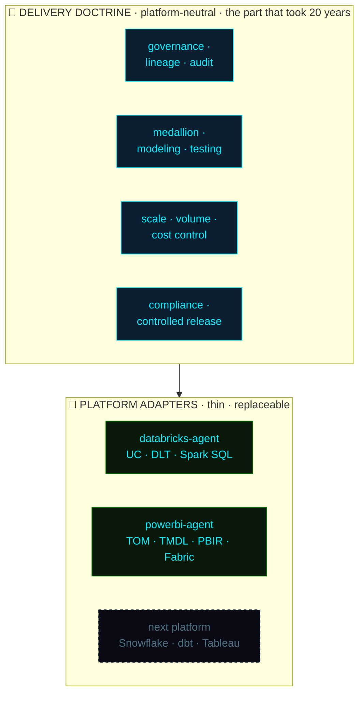
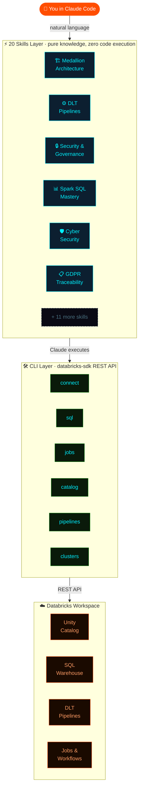
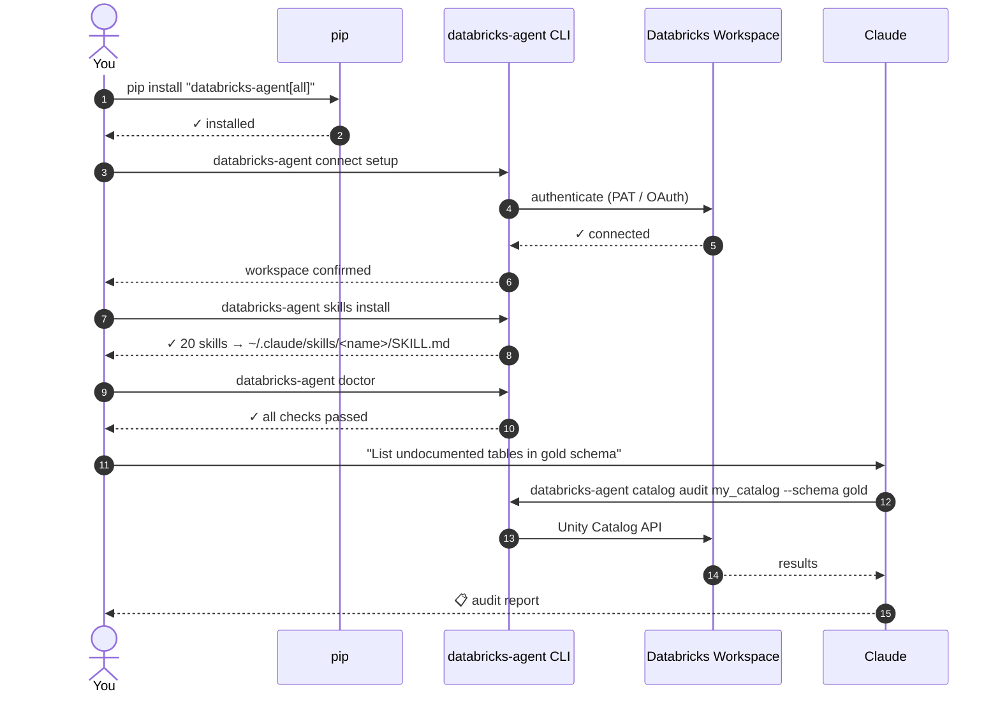
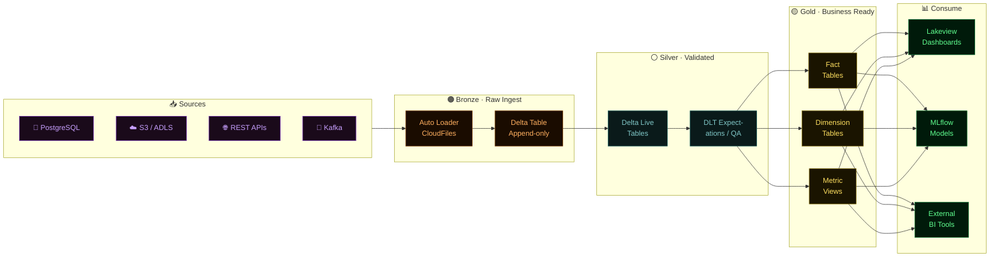
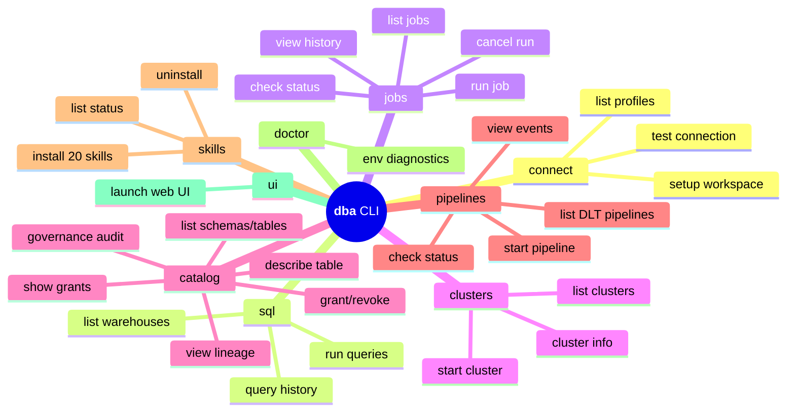
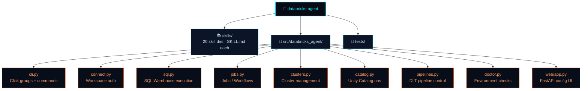

<div align="center">

```
╔═══════════════════════════════════════════════════════════════════════╗
║                                                                       ║
║    ██████╗  █████╗ ████████╗ █████╗ ██████╗ ██████╗  ██╗ ██████╗    ║
║    ██╔══██╗██╔══██╗╚══██╔══╝██╔══██╗██╔══██╗██╔══██╗██╔╝██╔════╝    ║
║    ██║  ██║███████║   ██║   ███████║██████╔╝██████╔╝██║ ██║         ║
║    ██║  ██║██╔══██║   ██║   ██╔══██║██╔══██╗██╔══██╗██║ ██║         ║
║    ██████╔╝██║  ██║   ██║   ██║  ██║██████╔╝██║  ██║██║ ╚██████╗    ║
║    ╚═════╝ ╚═╝  ╚═╝   ╚═╝   ╚═╝  ╚═╝╚═════╝ ╚═╝  ╚═╝╚═╝  ╚═════╝   ║
║                                                                       ║
║              A  G  E  N  T   //  T R O N · A R E S                  ║
║         AI-powered Databricks analytics engineering                   ║
╚═══════════════════════════════════════════════════════════════════════╝
```

[](https://python.org)
[](https://github.com/databricks/databricks-sdk-py)
[](skills/)
[](LICENSE)
[](https://www.linkedin.com/in/santoshkanthety/)

> **Give Claude Code enterprise-grade Databricks superpowers**
> AI-native CLI + 20 Claude Code skills · Unity Catalog · Delta Live Tables · Zero-trust security

</div>

---

## ⚡ What is this?

**databricks-agent** turns Claude into a Databricks expert. Once installed, Claude understands your workspace, Delta Lake patterns, Unity Catalog governance, DLT pipelines, and analytics engineering workflows — activated automatically by context, no copy-pasting docs required.

Built by **[Santosh Kanthety](https://www.linkedin.com/in/santoshkanthety/)** · 20+ years of Technology & Data transformation delivery and strategy.

**Free and open source (MIT).** Built in the open and given back to the data community — [contributions of any size are welcome](#-open-source-on-purpose).

---

---

## 🆕 What's New

| Release | Highlights |
|---|---|
| **v0.2 — platform & deployment** | **The deployment layer the pack was missing.** Three new skills: `databricks-cli` (the unified CLI — OAuth U2M and M2M, profiles per environment, the `--output json` contract, Unity Catalog inspection, `sync --watch`, `clusters events`, and the guard rails on `--full-refresh` and deletes), `databricks-asset-bundles` (DABs end to end — `databricks.yml`, targets and the `development` vs `production` mode trap, variables and list-override semantics, validate → deploy → summary → run, the dev→staging→prod promotion path, and why renaming a resource key is a delete plus a create), and `databricks-fabric-apps` (exposing Unity Catalog data to a Fabric App on the Rayfin SDK through a mirrored Azure Databricks catalog or a OneLake shortcut — including the fact that UC grants, row filters and column masks do **not** follow the data across that boundary). 20 skills |
| **v0.1** | Initial release — CLI (`connect` · `sql` · `jobs` · `clusters` · `catalog` · `pipelines`), 17 skills, canonical `<skill-name>/SKILL.md` layout validated against the [shared schema](SKILL_SCHEMA.md) in CI |

---

## 🧊 Beneath the Waterline

> **This CLI is the visible 10%.**
> What you install is one platform adapter sitting on top of a delivery doctrine built over 20+ years of shipping regulated, high-volume analytics inside tightly controlled enterprise environments — where the pipeline has to be right, auditable and defensible, not just fast to demo. The 20 skills are the codified version of that. The accelerators they were extracted from are the rest of the iceberg.

### The portable core

Most skill packs are written *for* one platform. These aren't. **Ten of these 20 concerns have a one-to-one counterpart in [powerbi-agent](https://github.com/santoshkanthety/powerbi-agent) — `databricks-medallion-architecture` ↔ `powerbi-medallion-architecture`, and nine more — each written in that platform's own idiom, not copy-pasted.** Governance, lineage, medallion layering and test strategy don't change when the engine does; only their expression does. The paired concerns:

`medallion-architecture` · `data-catalog-lineage` · `data-governance-traceability` · `data-transformation` · `source-integration` · `performance-scale` · `testing-validation` · `time-series-data` · `cyber-security` · `project-management`

Each exists as `databricks-<concern>` here and `powerbi-<concern>` there. The prefix is load-bearing: both packs install into `~/.claude/skills/`, so without it one would silently overwrite the other. Both repos validate against the same [skill schema](SKILL_SCHEMA.md) in CI.

The remaining skills are the same doctrine in Databricks dialect:

| Doctrine layer | Databricks dialect | Power BI dialect |
|---|---|---|
| Metric semantics | `databricks-metric-glossary` | `powerbi-measure-glossary` |
| Access control | `databricks-security-governance` | `powerbi-security-rls` |
| Query language | `databricks-spark-sql-mastery` | `powerbi-dax-mastery` |
| Physical modeling | `databricks-delta-modeling` | `powerbi-model` |
| Orchestration | `databricks-dlt-pipelines` | `powerbi-fabric-pipelines` |
| Presentation | `databricks-dashboard-authoring` | `powerbi-report-design` |
| Deployment as code | `databricks-asset-bundles` | `powerbi-pbip-format` + `powerbi-te-cli` |
| Platform CLI | `databricks-cli` | `powerbi-fabric-cli` |
| Custom app surface | `databricks-fabric-apps` | `powerbi-fabric-apps` |


```mermaid
flowchart TD
    subgraph CORE ["🧊 DELIVERY DOCTRINE · platform-neutral · the part that took 20 years"]
        direction LR
        G1["governance ·\nlineage · audit"]:::core
        G2["medallion ·\nmodeling · testing"]:::core
        G3["scale · volume ·\ncost control"]:::core
        G4["compliance ·\ncontrolled release"]:::core
    end

    subgraph ADAPT ["🔌 PLATFORM ADAPTERS · thin · replaceable"]
        direction LR
        A1["databricks-agent\nUC · DLT · Spark SQL"]:::ship
        A2["powerbi-agent\nTOM · TMDL · PBIR · Fabric"]:::ship
        A3["next platform\nSnowflake · dbt · Tableau"]:::next
    end

    CORE --> ADAPT

    classDef core fill:#0c1f30,color:#00f0ff,stroke:#00f0ff,stroke-width:1px
    classDef ship fill:#0a1a0a,color:#00f0ff,stroke:#007a00,stroke-width:1px
    classDef next fill:#0a0a14,color:#4a7080,stroke:#1a3040,stroke-dasharray:4
```

**The consequence:** the first platform costs what it costs. The second costs a fraction. The doctrine is already written, tested and in production — only the dialect changes.

### What this was built against

The skills here are not summaries of the Databricks docs. Each is a distilled answer to a problem that cost real time in a real environment:

| Constraint | What it forced into the doctrine |
|---|---|
| **Volume** | Pipelines that survive real partition skew and file counts — `performance-scale`, `delta-modeling`, `time-series-data` |
| **Compliance** | Provable answers to *where did this number come from* — `data-governance-traceability`, `data-catalog-lineage`, UC audit paths |
| **Controlled environments** | Locked workspaces, no-internet build hosts, least-privilege service principals — `cyber-security`, `security-governance`, OAuth M2M over PAT |
| **Budget** | Same doctrine runs on serverless SQL or a fixed job cluster; skills are Markdown, the CLI is MIT, nothing here bills per seat |
| **Multiple domains** | Finance, operations, engagement, HR, energy and healthcare-shaped data structures — reflected in the modeling and glossary skills rather than one vertical's vocabulary |

### Proof, not claims

Open repositories running the same doctrine end-to-end:

| Repo | What it demonstrates |
|---|---|
| **[energy-transition-etl](https://github.com/santoshkanthety/energy-transition-etl)** | This agent's doctrine in production shape — EIA API → bronze/silver/gold, Asset Bundles, Unity Catalog, PySpark |
| **[powerbi-agent](https://github.com/santoshkanthety/powerbi-agent)** | The sibling adapter — 45 skills, same core, different engine |
| **[journey-to-ironman-703](https://github.com/santoshkanthety/journey-to-ironman-703)** | The doctrine at small scale — API ingest → Postgres → KPI layer → Databricks dashboards |

### Where the iceberg goes

Public today: the CLI, the skills, the reference pipelines. Not public: the accelerators these were extracted from — deployment harnesses, domain-tuned quality rule packs, migration tooling, capacity-cost models, and the delivery playbooks that decide *which* of the above a given engagement actually needs.

Sizing a platform build, a migration or a governance retrofit and want the part that isn't on GitHub — **[linkedin.com/in/santoshkanthety](https://www.linkedin.com/in/santoshkanthety/)**.

---

## 🔭 How It Works


```mermaid
flowchart TD
    U(["👤 You in Claude Code"]):::user

    subgraph SKILLS ["⚡ 20 Skills Layer  ·  pure knowledge, zero code execution"]
        S1["🏗️ Medallion\nArchitecture"]:::skill
        S2["⚙️ DLT\nPipelines"]:::skill
        S3["🔒 Security &\nGovernance"]:::skill
        S4["📊 Spark SQL\nMastery"]:::skill
        S5["🛡️ Cyber\nSecurity"]:::skill
        S6["📋 GDPR\nTraceability"]:::skill
        S7["+ 11 more skills"]:::more
    end

    subgraph CLI ["🛠️ CLI Layer  ·  databricks-sdk REST API"]
        C1["connect"]:::cmd
        C2["sql"]:::cmd
        C3["jobs"]:::cmd
        C4["catalog"]:::cmd
        C5["pipelines"]:::cmd
        C6["clusters"]:::cmd
    end

    subgraph WS ["☁️ Databricks Workspace"]
        W1["Unity\nCatalog"]:::ws
        W2["SQL\nWarehouse"]:::ws
        W3["DLT\nPipelines"]:::ws
        W4["Jobs &\nWorkflows"]:::ws
    end

    U -->|"natural language"| SKILLS
    SKILLS -->|"Claude executes"| CLI
    CLI -->|"REST API"| WS

    classDef user fill:#ff4e00,color:#fff,stroke:none
    classDef skill fill:#0c1f30,color:#00f0ff,stroke:#00f0ff,stroke-width:1px
    classDef more fill:#0a0a14,color:#4a7080,stroke:#1a3040,stroke-dasharray:4
    classDef cmd fill:#0a1a0a,color:#00f0ff,stroke:#007a00,stroke-width:1px
    classDef ws fill:#1a0a00,color:#ff9a60,stroke:#ff4e00,stroke-width:1px
```

---

## 🔧 Prerequisites

| Requirement | Version | Notes |
|---|---|---|
| **Python** | 3.10 – 3.14 | `python --version` |
| **pip** | Latest | `pip install --upgrade pip` |
| **Claude Code** | Latest | [Install guide](https://claude.ai/code) — required for skills |
| **Databricks Workspace** | Any cloud | Azure / AWS / GCP — Unity Catalog recommended |
| **Databricks SDK** | Latest | Auto-installed with `pip install databricks-agent` |
| **Authentication** | PAT or OAuth | Personal Access Token **or** OAuth M2M service principal |
| **SQL Warehouse** | Active | Required for `databricks-agent sql` commands |
| **Unity Catalog** | Enabled | Required for `catalog` commands — metastore must be attached |
| **Delta Live Tables** | Optional | Required for `pipelines` commands |
| **MLflow** | Optional | `pip install "databricks-agent[ml]"` — ML workflow skills |

<details>
<summary><code>► Getting a Personal Access Token (PAT)</code></summary>

1. Open your Databricks workspace
2. Click your username (top-right) → **Settings** → **Developer**
3. Click **Access Tokens** → **Generate new token**
4. Set a description and expiry, then copy the token
5. Run `databricks-agent connect setup` and paste it when prompted

</details>

<details>
<summary><code>► Supported Cloud Host Formats</code></summary>

| Cloud | Host format |
|---|---|
| **Azure** | `https://adb-<id>.<region>.azuredatabricks.net` |
| **AWS** | `https://<id>.cloud.databricks.com` |
| **GCP** | `https://<id>.<region>.gcp.databricks.com` |

</details>

---

## 🚀 Quickstart


```mermaid
sequenceDiagram
    autonumber
    actor You
    participant pip
    participant CLI as databricks-agent CLI
    participant WS as Databricks Workspace
    participant Claude

    You->>pip: pip install "databricks-agent[all]"
    pip-->>You: ✓ installed

    You->>CLI: databricks-agent connect setup
    CLI->>WS: authenticate (PAT / OAuth)
    WS-->>CLI: ✓ connected
    CLI-->>You: workspace confirmed

    You->>CLI: databricks-agent skills install
    CLI-->>You: ✓ 20 skills → ~/.claude/skills/<name>/SKILL.md

    You->>CLI: databricks-agent doctor
    CLI-->>You: ✓ all checks passed

    You->>Claude: "List undocumented tables in gold schema"
    Claude->>CLI: databricks-agent catalog audit my_catalog --schema gold
    CLI->>WS: Unity Catalog API
    WS-->>Claude: results
    Claude-->>You: 📋 audit report
```

**Then just ask Claude:**

```
"Run an incremental load from bronze.orders to silver.orders"
"Check the status of my nightly ETL job and show failures"
"Explain the column lineage of catalog.gold.revenue_summary"
"Set up row filters so each region only sees their own data"
"Detect any credential leaks in my notebooks"
```

---

## 🏗️ Data Pipeline Architecture


```mermaid
flowchart LR
    subgraph SOURCES ["📥 Sources"]
        PG["🐘 PostgreSQL"]:::src
        S3["☁️ S3 / ADLS"]:::src
        API["🌐 REST APIs"]:::src
        KF["📨 Kafka"]:::src
    end

    subgraph BRONZE ["🟤 Bronze  ·  Raw Ingest"]
        AL["Auto Loader\nCloudFiles"]:::bronze
        BRAW["Delta Table\nAppend-only"]:::bronze
    end

    subgraph SILVER ["⚪ Silver  ·  Validated"]
        DLT["Delta Live\nTables"]:::silver
        EXP["DLT Expect-\nations / QA"]:::silver
    end

    subgraph GOLD ["🟡 Gold  ·  Business Ready"]
        FAC["Fact\nTables"]:::gold
        DIM["Dimension\nTables"]:::gold
        MET["Metric\nViews"]:::gold
    end

    subgraph CONSUME ["📊 Consume"]
        DB["Lakeview\nDashboards"]:::out
        ML["MLflow\nModels"]:::out
        EXT["External\nBI Tools"]:::out
    end

    SOURCES --> AL
    AL --> BRAW
    BRAW --> DLT
    DLT --> EXP
    EXP --> FAC & DIM & MET
    FAC & DIM & MET --> DB & ML & EXT

    classDef src fill:#1a0a1a,color:#c8a0ff,stroke:#6a20b0,stroke-width:1px
    classDef bronze fill:#1a0c00,color:#ffb060,stroke:#804000,stroke-width:1px
    classDef silver fill:#0a1a1a,color:#80c8c8,stroke:#206868,stroke-width:1px
    classDef gold fill:#1a1400,color:#ffe060,stroke:#806800,stroke-width:1px
    classDef out fill:#001a0a,color:#60ff90,stroke:#007030,stroke-width:1px
```

---

## ⬡ 20 Claude Code Skills

Skills are markdown knowledge files that activate automatically when Claude detects matching keywords. Install once, use forever.

```bash
databricks-agent skills install   # → ~/.claude/skills/
```

### 🏗️ Architecture & Modeling
| Skill | Triggers on |
|---|---|
| `databricks-medallion-architecture` | bronze · silver · gold · Delta Lake · V-Order · Liquid Clustering |
| `databricks-delta-modeling` | star schema · SCD · fact table · dimension · surrogate key · grain |
| `databricks-spark-sql-mastery` | window function · aggregation · CTE · explain plan · OVER PARTITION |

### ⚙️ Ingestion & Pipelines
| Skill | Triggers on |
|---|---|
| `databricks-dlt-pipelines` | Delta Live Tables · Auto Loader · CDC · APPLY CHANGES · Workflows |
| `databricks-source-integration` | PostgreSQL · JDBC · Kafka · REST API · Auto Loader · S3 · ADLS |
| `databricks-data-transformation` | union · merge · dedup · schema drift · surrogate key · upsert |

### 📊 Analytics & Metrics
| Skill | Triggers on |
|---|---|
| `databricks-metric-glossary` | dbt metrics · semantic layer · metric definition · KPI · undocumented |
| `databricks-dashboard-authoring` | Lakeview · DBSQL · chart · filter · parameter · drilldown |
| `databricks-time-series-data` | time series · gaps · LOCF · binning · IoT · streaming window |

### 🔒 Security & Governance
| Skill | Triggers on |
|---|---|
| `databricks-security-governance` | row filter · column mask · GRANT · ACL · audit log · PII |
| `databricks-data-governance-traceability` | GDPR · CCPA · erasure · DSAR · lineage · retention · consent |
| `databricks-cyber-security` | threat detection · secrets · zero trust · SOC2 · credential leak |
| `databricks-data-catalog-lineage` | Unity Catalog · lineage · tagging · endorsement · impact analysis |

### 🚀 Platform & Deployment
| Skill | Triggers on |
|---|---|
| `databricks-cli` | databricks CLI · auth login · .databrickscfg · profile · --output json |
| `databricks-asset-bundles` | asset bundle · DAB · databricks.yml · bundle deploy · target · promote |
| `databricks-fabric-apps` | Fabric App · Rayfin · mirrored Unity Catalog · OneLake shortcut |

### ⚡ Performance & Operations
| Skill | Triggers on |
|---|---|
| `databricks-performance-scale` | slow query · cluster sizing · Photon · AQE · shuffle · spill |
| `databricks-testing-validation` | DLT expectations · reconciliation · dbt test · assertion · UAT |
| `databricks-project-management` | delivery · sprint · RAID log · go-live · hypercare · SLA |
| `databricks-connect` | connect · auth · PAT · OAuth · workspace · no connection |

---

## 🛠️ CLI Command Suite


```mermaid
mindmap
  root((**dba** CLI))
    connect
      setup workspace
      list profiles
      test connection
    sql
      run queries
      list warehouses
      query history
    jobs
      list jobs
      run job
      check status
      cancel run
      view history
    clusters
      list clusters
      start cluster
      cluster info
    catalog
      list schemas/tables
      describe table
      view lineage
      show grants
      grant/revoke
      governance audit
    pipelines
      list DLT pipelines
      start pipeline
      check status
      view events
    skills
      install 20 skills
      uninstall
      list status
    doctor
      env diagnostics
    ui
      launch web UI
```

---

## 💡 Live Examples

```bash
# ── SQL & Warehouses ─────────────────────────────────────────────
dba sql query --sql "SELECT * FROM catalog.gold.revenue LIMIT 10" \
              --warehouse my-warehouse --output table

# ── Jobs & Workflows ─────────────────────────────────────────────
dba jobs run --name nightly-etl
dba jobs status --run-id 12345
dba jobs history --name nightly-etl --limit 10

# ── Unity Catalog ─────────────────────────────────────────────────
dba catalog list my_catalog --schema gold
dba catalog describe catalog.gold.revenue_summary
dba catalog lineage catalog.gold.revenue_summary
dba catalog audit my_catalog --schema gold          # governance gaps

# ── DLT Pipelines ────────────────────────────────────────────────
dba pipelines start --name orders-pipeline
dba pipelines events --name orders-pipeline --limit 20

# ── Clusters ─────────────────────────────────────────────────────
dba clusters list
dba clusters start --name prod-cluster
```

---

## 📦 Installation Options

```bash
# Core CLI
pip install databricks-agent

# + Web configuration UI  (FastAPI)
pip install "databricks-agent[ui]"

# + MLflow / ML workflow support
pip install "databricks-agent[ml]"

# Everything
pip install "databricks-agent[all]"
```

**Skill layout:** each skill installs to `~/.claude/skills/<skill-name>/SKILL.md` — the canonical Agent Skills layout Claude Code discovers. Skills are namespaced `databricks-*` so they coexist with `powerbi-agent`, and validate against the shared [skill schema](SKILL_SCHEMA.md) in CI via `scripts/validate_skills.py`.

**Auth methods supported (via Databricks SDK):**
`PAT token` · `~/.databrickscfg profiles` · `DATABRICKS_HOST + DATABRICKS_TOKEN env vars` · `OAuth M2M` · `Azure Managed Identity` · `Entra ID`

---

## 📁 Project Structure


```mermaid
flowchart TD
    ROOT["📁 databricks-agent"]:::root

    ROOT --> SKILLS["📚 skills/\n20 skill dirs · SKILL.md each"]:::layer
    ROOT --> SRC["🐍 src/databricks_agent/"]:::layer
    ROOT --> TESTS["🧪 tests/"]:::layer

    SRC --> CLI["cli.py\nClick groups + commands"]:::mod
    SRC --> CONN["connect.py\nWorkspace auth"]:::mod
    SRC --> SQLM["sql.py\nSQL Warehouse execution"]:::mod
    SRC --> JOBSM["jobs.py\nJobs / Workflows"]:::mod
    SRC --> CLUS["clusters.py\nCluster management"]:::mod
    SRC --> CAT["catalog.py\nUnity Catalog ops"]:::mod
    SRC --> PIPE["pipelines.py\nDLT pipeline control"]:::mod
    SRC --> DOC["doctor.py\nEnvironment checks"]:::mod
    SRC --> WEB["web/app.py\nFastAPI config UI"]:::mod

    classDef root fill:#0a0a14,color:#00f0ff,stroke:#00f0ff,stroke-width:2px
    classDef layer fill:#0c1428,color:#c8e8f0,stroke:#00f0ff,stroke-width:1px
    classDef mod fill:#080d1a,color:#ff9a60,stroke:#ff4e00,stroke-width:1px
```

---

## 🤝 Open source, on purpose

**This project is MIT-licensed and open to anyone.** Fork it, run it in client work,
rip it apart for parts, ship your own adapter. No CLA, no gatekeeping, no permission needed.

Everything I know about data engineering I learned from people who published their
work for free — blog posts, sample notebooks, half-finished repos, answers on forums at
2am. This is me paying that forward. If it saves you a week, it did its job.

Contributions of every size are welcome, and **you do not need to be a Databricks expert
to make one.** A typo fix in a skill file is a real contribution.

```
NO PYTHON REQUIRED:
  📝 Improve a skill file in skills/   (pure Markdown — 20 of them)
  📊 Add a real-world Delta / DLT / Unity Catalog pattern
  🐞 Report a bug with reproduction steps
  💡 Open an issue suggesting a skill or CLI command you wish existed

WITH PYTHON:
  ⚡ New skills   (ML/MLflow, cost optimization, streaming patterns)
  🛠  CLI commands (workspace files, secrets, volumes)
  🧪 Integration tests
  🎨 Web UI improvements

SETUP:
  git clone https://github.com/santoshkanthety/databricks-agent
  cd databricks-agent
  pip install -e ".[all]"
  pytest
```

Full guidelines in [CONTRIBUTING.md](CONTRIBUTING.md). First PR ever? Open it anyway —
I would rather review a rough patch than never see the idea.

[](https://github.com/santoshkanthety/databricks-agent/issues)
[](https://github.com/santoshkanthety/databricks-agent/pulls)
[](https://github.com/santoshkanthety/databricks-agent/issues?q=is%3Aissue+is%3Aopen+label%3A%22good+first+issue%22)

---

<div align="center">

```
╔═══════════════════════════════════════════════════════════════╗
║                                                               ║
║   ⚡  DATABRICKS · AGENT  //  TRON ARES  //  v0.2.0          ║
║                                                               ║
║   Built by  SANTOSH KANTHETY                                  ║
║   20+ years of Technology & Data transformation               ║
║   delivery and strategy                                       ║
║                                                               ║
║   github.com/santoshkanthety/databricks-agent                 ║
║   linkedin.com/in/santoshkanthety                             ║
║                                                               ║
║   If this saves you time — give it a ★                        ║
║                                                               ║
╚═══════════════════════════════════════════════════════════════╝
```

MIT License · Sibling adapter: [powerbi-agent](https://github.com/santoshkanthety/powerbi-agent) · Credits in [ATTRIBUTIONS.md](ATTRIBUTIONS.md)

</div>
